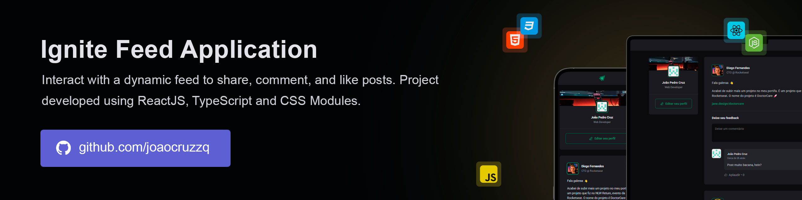

# Ignite Feed  

Ignite Feed is a social media-inspired feed application that lets users comment and like posts with ease. Designed to replicate popular platforms, it offers a smooth, intuitive experience for seamless interaction with content.

> 🔥 Built with the latest web technologies to ensure fast speed, high performance, and a seamless user experience. It leverages modern tools to deliver a responsive and intuitive interface across devices.



## Running

Follow these steps to run the project locally:

1. Clone the repository:
   ```sh
   git clone https://github.com/joaocruzzq/ignite-feed.git
   cd ignite-feed
   ```

2. Install dependencies:
   ```sh
   npm install
   ```

3. Run the application:
   ```
   npm run dev
   ```

> Note: Make sure you have <a href="https://nodejs.org/pt">Node.js</a> installed before starting.

## Features

> This application **should be able to**:

- display a feed of posts for users to interact with.
- allow users to comment on posts to engage in discussions.
- applaud comments to show appreciation without any limit on the number of applauds.

## 🛠️ Technologies Used

| **Technology**        | **Description**                                                   | **Version** |
|-----------------------|-------------------------------------------------------------------|-------------|
| **React**             | A frontend library for building the user interface.              | 18.3.1      |
| **TypeScript**        | A typed superset of JavaScript that provides static types.        | 5.6.2       |
| **Vite**              | A fast build tool and development server.                         | 6.0.5       |
| **Date-fns**          | A lightweight library for working with dates in JavaScript.       | 4.1.0      |
